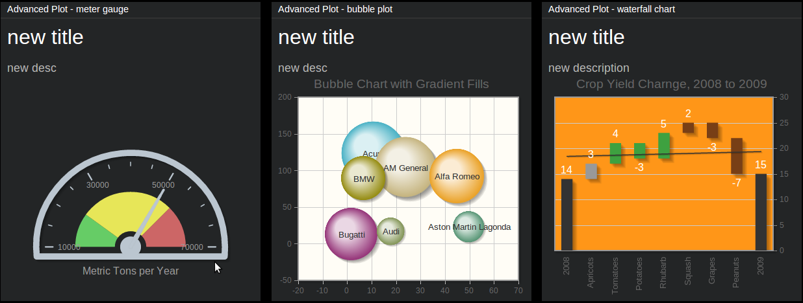

=================
``advanced_plot``
=================

**Description**

This tile is for more demanding users. It basically allows to display arbitrary
type of chart/plot from the `jqPlot <http://www.jqplot.com/>`_ library, along
with the title and description (both are optional).

Before you start experimenting with jqPlot library, we suggest to familiarize
yourself with `this manual
<http://www.jqplot.com/docs/files/usage-txt.html#jqPlot_Usage>`_. After that
you should check out `options tutorial
<http://www.jqplot.com/docs/files/optionsTutorial-txt.html#Options_Tutorial>`_
and `options summary <http://www.jqplot.com/docs/files/jqplot-core-js.html>`_.

Here you will find `some examples <http://www.jqplot.com/deploy/dist/examples/>`_.

**Content**

::

  "data" = {
      "title": "<tile>",
      "description": "<description>",
      "plot_data": "<data>"
  }

where:

.. describe:: title, description

   Title and description (subtitle) for the tile.

.. describe:: plot_data

   Data that will be fed directly to your plot. Its form depends on the
   specific type of plot that you are going to use - see jqPlot's documentation
   for the details.

Example (using horizontal `Bar Chart
<http://www.jqplot.com/deploy/dist/examples/barTest.html>`_ - third example
from the top)::

  curl http://localhost:7272/api/v0.1/<api_key>/push
       -X POST
       -d "tile=advanced_plot"
       -d "key=<tile_id>"
       -d 'data={"title": "Metric Tons per Year", "description": "",
                 "plot_data": [[[2,1], [4,2], [6,3], [3,4]],
                               [[5,1], [1,2], [3,3], [4,4]],
                               [[4,1], [7,2], [1,3], [2,4]]]}'

.. note::

   Keep in mind that ``advanced_plot`` can display arbitrary charts from jqPlot
   library, and more than often they are quite different when it comes to the
   parameters required etc.

**Configuration**

::

  value = {
    "value": "<jqplot_config>"
  }

where:

.. describe:: value

   Raw configuration that will be passed directly to jqPlot and which should
   obey the rules defined by the jqPlot library. Internally, this config will
   be passed as ``$.jqplot(some-container, some-data, our-config)``.

   If such configuration contains one of jqPlot's renderers, its name should be
   passed as a string, according to the table below:

   +--------------------------------------+-------------------------------+
   | jqPlot's renderer                    | string to send                |
   +======================================+===============================+
   | ``$.jqplot.BarRenderer``             | ``"BarRenderer"``             |
   +--------------------------------------+-------------------------------+
   | ``$.jqplot.BlockRenderer``           | ``"BlockRenderer"``           |
   +--------------------------------------+-------------------------------+
   | ``$.jqplot.BubbleRenderer``          | ``"BubbleRenderer"``          |
   +--------------------------------------+-------------------------------+
   | ``$.jqplot.CanvasAxisLabelRenderer`` | ``"CanvasAxisLabelRenderer"`` |
   +--------------------------------------+-------------------------------+
   | ``$.jqplot.CanvasAxisTickRenderer``  | ``"CanvasAxisTickRenderer"``  |
   +--------------------------------------+-------------------------------+
   | ``$.jqplot.CanvasTextRenderer``      | ``"CanvasTextRenderer"``      |
   +--------------------------------------+-------------------------------+
   | ``$.jqplot.CategoryAxisRenderer``    | ``"CategoryAxisRenderer"``    |
   +--------------------------------------+-------------------------------+
   | ``$.jqplot.DateAxisRenderer``        | ``"DateAxisRenderer"``        |
   +--------------------------------------+-------------------------------+
   | ``$.jqplot.DonutRenderer``           | ``"DonutRenderer"``           |
   +--------------------------------------+-------------------------------+
   | ``$.jqplot.EnhancedLegendRenderer``  | ``"EnhancedLegendRenderer"``  |
   +--------------------------------------+-------------------------------+
   | ``$.jqplot.FunnelRenderer``          | ``"FunnelRenderer"``          |
   +--------------------------------------+-------------------------------+
   | ``$.jqplot.LogAxisRenderer``         | ``"LogAxisRenderer"``         |
   +--------------------------------------+-------------------------------+
   | ``$.jqplot.MekkoAxisRenderer``       | ``"MekkoAxisRenderer"``       |
   +--------------------------------------+-------------------------------+
   | ``$.jqplot.MekkoRenderer``           | ``"MekkoRenderer"``           |
   +--------------------------------------+-------------------------------+
   | ``$.jqplot.MeterGaugeRenderer``      | ``"MeterGaugeRenderer"``      |
   +--------------------------------------+-------------------------------+
   | ``$.jqplot.OhlcRenderer``            | ``"OhlcRenderer"``            |
   +--------------------------------------+-------------------------------+
   | ``$.jqplot.PieRenderer``             | ``"PieRenderer"``             |
   +--------------------------------------+-------------------------------+
   | ``$.jqplot.PyramidAxisRenderer``     | ``"PyramidAxisRenderer"``     |
   +--------------------------------------+-------------------------------+
   | ``$.jqplot.PyramidGridRenderer``     | ``"PyramidGridRenderer"``     |
   +--------------------------------------+-------------------------------+
   | ``$.jqplot.PyramidRenderer``         | ``"PyramidRenderer"``         |
   +--------------------------------------+-------------------------------+

Example (using horizontal `Bar Chart
<http://www.jqplot.com/deploy/dist/examples/barTest.html>`_ - third example
from the top)::

  curl http://localhost:7272/api/v0.1/<api_key>/tileconfig/<tile_id>
       -X POST
       -d 'value={
              "seriesDefaults": {
                  "trendline": {"show": false},
                  "renderer":"BarRenderer",
                  "pointLabels": {"show": true, "location": "e", "edgeTolerance": -15},
                  "shadowAngle": 135,
                  "rendererOptions": {"barDirection": "horizontal"}
              },
              "axes": {"yaxis": { "renderer": "CategoryAxisRenderer"}}}'
