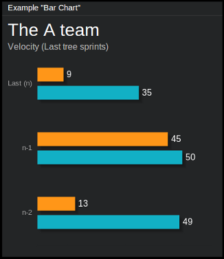

=============
``bar_chart``
=============

**Description**

Tile displaying data in the form of horizontal bar charts. Each cart may
consist of one or more series of data - in the latter case, such bars are
grouped respectively. There are no "hard" limits when it comes to the number of
charts/series, although we suggest to keep them down to 3 charts of 2 series
each.

**Content**

::

  data = {
      "title": "<title>",
      "subtitle": "<subtitle>",
      "ticks": ["<label1>", "<label2>", "<label3>" ...],
      "series_list": [[<val1>, <val2>, <val3>, ...],
                      [<val1>, <val2>, <val3>, ...]]
  }

where:

.. describe:: title, subtitle

   Title and subtitle displayed on the top of the tile.

.. describe:: ticks

   Labels to be displayed on the left side of the charts.

.. describe:: series_list

   List of series, as name suggests. ``[[1, 2]]`` will give one chart of two
   bars, ``[[3, 4, 5], [6, 7, 8]]`` will give two charts of three bars each.

Example::

  curl http://localhost:7272/api/v0.1/<api_key>/push
       -X POST
       -d "tile=bar_chart"
       -d "key=<tile_id>"
       -d 'data={"title": "The A-Team",
                 "subtitle": "Velocity (Last tree sprints)",
                 "ticks": ["n-2", "n-1", "Last (n)"],
                 "series_list": [[49, 50, 35], [13, 45, 9]]}'

**Configuration**

This tile does not offer any configuration options.

.. note::

   In case of displaying more than one charts on the same tile, the number of
   values in ``series_list`` for every chart should be the same (and they
   should be equal to the number of ``ticks``.
