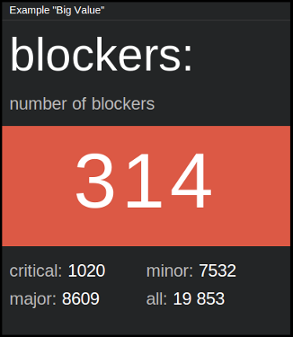

=============
``big_value``
=============

**Description**

This is a variation of ``simple_percentage`` tile. It has slightly different
footer (four possible values instead of just two; values are displayed on the
right side of the label instead of below), and the main value (``big_value``)
is little bit bigger.

**Content**

::

  data = {
      "title": "<title>",
      "description": "<description>",
      "big-value": "<value>",
      "upper-left-label": "<label>",
      "upper-left-value": "<value>",
      "lower-left-label": "<label>",
      "lower-left-value": "<value>",
      "upper-right-label": "<label>",
      "upper-right-value": "<value>",
      "lower-right-label": "<label>",
      "lower-right-value": "<value>"
  }

where:

.. describe:: title, description

   Title and description (subtitle) for the tile.

.. describe:: big_value

   Main value, which treated as a string, so it can contain symbols like ``%`` etc.

.. describe:: upper-left-value, lower-left-value, upper-right-value, lower-right-value

   Smaller, bottom-left and bottom-right values.

.. describe:: upper-left-label, lower-left-label, upper-right-label, lower-right-label

   Labels for above values.

Example::

  curl http://localhost:7272/api/v0.1/<api_key>/push
       -X POST
       -d "tile=big_value"
       -d "key=<tile_id>"
       -d 'data={"title": "Tickets",
                 "description": "number of blockers",
                 "big-value": "314",
                 "upper-left-label": "critical:",
                 "upper-left-value": "1020",
                 "lower-left-label": "major:",
                 "lower-left-value": "8609",
                 "upper-right-label": "minor:",
                 "upper-right-value": "7532",
                 "lower-right-label": "all:",
                 "lower-right-value": "19 853"}'

**Configuration**

::

  value = {
      "big_value_color": "<color>",
      "fading_background": <BOOLEAN>
  }

where:

.. describe:: big_value_color

   Background color for ``big_value`` in a hexadecimal form or color name (e.g.
   ``#94C140`` or ``green``).

.. describe:: fading_background

   Turns on/off background pulsation for ``big_value`` (may be useful for
   alerts etc.).

   .. versionadded:: 1.3.0

Example::

    curl http://localhost:7272/api/v0.1/<api_key>/tileconfig/<tile_id>
         -X POST
         -d 'value={"big_value_color": "green", "fading_background": true}'
