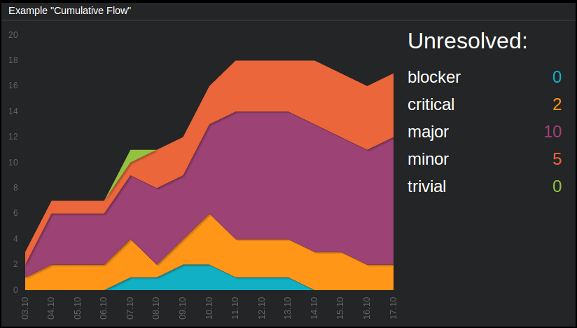

===================
``cumulative_flow``
===================

**Description**

Cumulative chart using `jqPlot <http://www.jqplot.com/>`_ library. Allows to
display up to seven plots on a single chart.

**Content**

::

  data = {
      "title": "<title>",
      "series_list": [{"label": "<label1>", "series": [<val1>, <val2>, ...]},
                      {"label": "<label2>", "series": [<val1>, <val2>, ...]}]
  }

where:

.. describe:: title

   Title to be displayed above the labels.

.. describe:: series_list

   A container (i.e. list of objects) for the data; each such object
   corresponding to a single plot consists of two keys: ``label`` and
   ``series``, where the latter is a list of values constructing the plot.

Example::

  curl http://localhost:7272/api/v0.1/<api_key>/push
       -X POST
       -d "tile=cumulative_flow"
       -d "key=<tile_id>"
       -d 'data={"title": "My title:",
                 "series_list": [{"label": "label 1", "series": [ 0, 0, 0, 0, 1, 1, 2, 2, 1, 1, 1, 0, 0, 2, 0 ]},
                                 {"label": "label 2", "series": [ 0, 5, 0, 0, 1, 0, 0, 3, 0, 0, 0, 7, 8, 9, 1 ]}]}'

**Configuration**

::

  value = {"ticks": [[<key>, "<value>"], [<key>, "<value>"], ... ]}

where:

.. describe:: ticks

   List of elements defining x-axis; each such element is a list of form ``[k,
   v]`` where ``k`` is an oridinal number designating position of such tick and
   ``v`` is a string which will be displayed in that place.

Example::

    curl http://localhost:7272/api/v0.1/<api_key>/tileconfig/<tile_id>
        -X POST
        -d 'value={"ticks": [[1, "mon"], [2, "tue"], [3, "wed"], [4, "thu"], [5, "fri"], [6, "sat"], [7, "sun"]]}'

.. note::

   If ``series_list`` contains more than one object (which is the case 99% of
   the time), each one of them should have ``series`` list of the same length -
   and this lenght should be equal to the number of ``ticks``.
