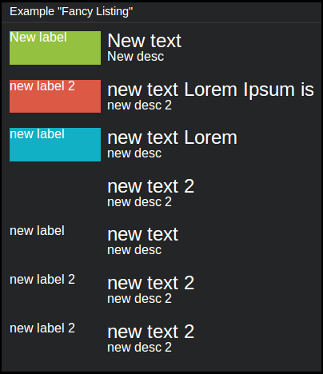

=================
``fancy_listing``
=================

**Description**

This tile is a more sophisticated version of ``listing`` tile offering colored
labels and centering options. Each entry is an object containing three keys:
``label``, ``text`` and ``description``. Threrefore, ``data`` (i.e. content) is
just a list of such objects.

**Content**

::

  "data" = [
      {"label": "<label1>", "text": "<entry1>", "description": "<desc1>" },
      {"label": "<label2>", "text": "<entry2>", "description": "<desc2>" }
  ]

where:

.. describe:: label

   Smaller label displayed on the left which can be colored.

.. describe:: text

   A textual entry to be displayed next to the label.

.. describe:: description

   Subtitle displayed below ``text`` element.

Example::

  curl http://localhost:7272/api/v0.1/<api_key>/push
       -X POST
       -d "tile=fancy_listing"
       -d "key=<tile_id>"
       -d 'data=[{"label": "My label 1", "text": "Lorem ipsum", "description": "such description" },
                 {"label": "My label 2", "text": "Dolor sit", "description": "yet another" },
                 {"label": "My label 3", "text": "Amet", "description": "" }]'

**Configuration**

::

  value = {
      "vertical_center": <BOOLEAN>,
      "<position>": {
          "label_color": "<color>",
          "center": <BOOLEAN>
      },
  }

where:

.. describe:: vertical_center

   Centers vertically all the entries (along with their labels).

   .. versionadded:: 1.3.0

.. describe:: position

   Tells which entry (starting from 1) should be a subject to ``label_color``
   and ``center`` (specified as subkeys of ``position``).

   .. describe:: label_color

      Sets the color of label for the entry given with ``position``. Color can
      be specified in a hexadecimal form (``#RRGGBB``) or by name (e.g.
      ``green``).

   .. describe:: center

      Centers horizontally entry's ``text`` and ``description`` (it does not
      affect label's position).

      .. versionadded:: 1.3.0

Example::

    curl http://localhost:7272/api/v0.1/<api_key>/tileconfig/<tile_id>
         -X POST
         -d 'value={"vertical_center": true,
                    "1": {"label_color": "red", "center": true},
                    "3": {"label_color": "green", "center": true }}'
