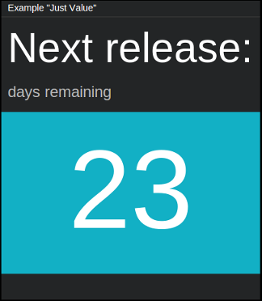

==============
``just_value``
==============

**Description**

Tile for displaying single, short information with a possibility to change its
background color.

**Content**

::

  "data" = {
      "title": "<title>",
      "description": "<description>",
      "just-value": "<value>"
  }

where:

.. describe:: title, description

   Title and description (subtitle) for the tile.

.. describe:: just-value

   Value to be displayed on the tile, with optionally colored background.

Example::

  curl http://localhost:7272/api/v0.1/<api_key>/push
       -X POST
       -d "tile=just_value"
       -d "key=<tile_id>"
       -d 'data={"title": "Next release:", "description": "(days remaining)", "just-value": "23"}'

**Configuration**

::

  value = {
      "just-value-color": "<color>",
      "fading_background": <BOOLEAN>
  }

where:

.. describe:: just-value-color

   Background color for ``just-value`` in a hexadecimal form or color name (e.g.
   ``#94C140`` or ``green``).

.. describe:: fading_background

   Turns on/off background pulsation for ``just-value`` (may be useful for
   alerts etc.).

   .. versionadded:: 1.3.0

Example::

    curl http://localhost:7272/api/v0.1/<api_key>/tileconfig/<tile_id>
         -X POST
         -d 'value={"just-value-color": "green", "fading_background": true}'
