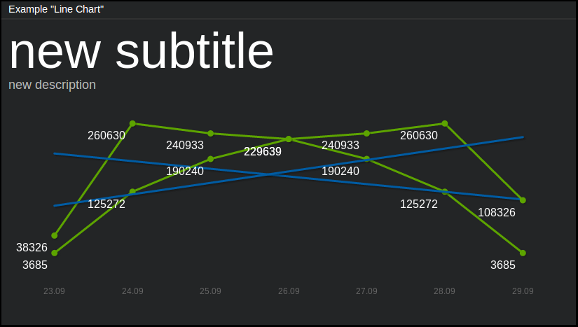

==============
``line_chart``
==============

**Description**

Line-chart using `jqPlot <http://www.jqplot.com/>`_ library. Allows to display
arbitrary number of plots on single chart, with automatical generation of trend
lines for them (which is turned on by default).

**Content**

::

  data = {
      "subtitle": "<subtitle_text">,
      "description": "<description_text>",
      "series_list": [[<series1>], [<series2>], [<series3>], ...]
  }

where:

.. describe:: subtitle, description

   Additional text fields for charts descriptions (optional - you can pass
   empty strings here).

.. describe:: series_list

   Data for line-charts in a form of list of series, where each series
   designates single chart; each element of a given series is a pair
   ``[x_axis_value, y_axis_value]``.

Example::

  curl http://localhost:7272/api/v0.1/<api_key>/push
       -X POST
       -d "tile=line_chart"
       -d "key=example_line"
       -d 'data={"subtitle": "averages from last week",
                 "description": "Sales in our dept",
                 "series_list": [[["23.09", 8326], ["24.09", 260630], ["25.09", 240933], ["26.09", 229639], ["27.09", 190240], ["28.09", 125272], ["29.09", 3685]],
                                 [["23.09", 3685], ["24.09", 125272], ["25.09", 190240], ["26.09", 229639], ["27.09", 240933], ["28.09", 260630], ["29.09", 108326]]]}'

-- this will give two plots on a single chart (on x-axis there will be "23.09",
"24.09", "25.09" and so on) with heading "Sales in our dept" and subtitle
"averages from last week".

**Configuration**

::

  value = {<jqplot_config>}

where:

.. describe:: jqplot_config

   Configuration params in the form described by `jqPlot documentation
   <http://www.jqplot.com/tests/line-charts.php>`_.

Example::

    curl http://localhost:7272/api/v0.1/<api_key>/tileconfig/example_line
         -X POST
         -d 'value={"grid": {"drawGridLines": true,
                             "gridLineColor": "#FFFFFF",
                             "shadow": false,
                             "background": "#000000",
                             "borderWidth": 0}}'

-- this will set up the grid (in white color), black background and will turn
off shadow effects as well as borders.

.. note::

   In case of displaying multiple plots on a single chart (e.g. for more than
   one data series) you have to keep in mind that the ``x_axis_value`` values
   should be the same for all of those plots.
