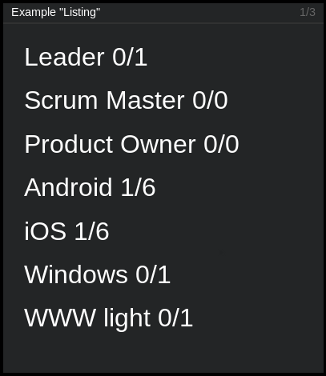

===========
``listing``
===========

**Description**

Very simple tile for displaying list of entries (up to seven) of arbitrary
content. For more sophisticated needs there is a ``fancy_listing`` tile.

**Content**

::

  data = {"items": ["<entry1>", "<entry2>", ..., "<entry7>"]}

where:

.. describe:: items

   List of items (entries) to display.

Example::

  curl http://localhost:7272/api/v0.1/<api_key>/push
       -X POST
       -d "tile=listing"
       -d "key=<tile_id>"
       -d "data={"items": ["Leader: 5", "Product Owner: 0", "Scrum Master: 3", "Developer: 0"]}"

**Configuration**

This tile does not offer any configuration options.
