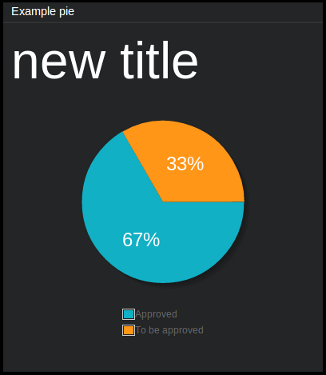

=============
``pie_chart``
=============

**Description**

"Pie-chart" style chart using `jqPlot <http://www.jqplot.com/>`_ library, with
optional legend.

**Content**

::

  data = {
      "title": "<optional_title>",
      "pie_data": [[identifier1, value1], [identifier2, value2], ...]
  }

where:

.. describe:: title

   Chart's title (optional).

.. describe:: pie_data

   Data for pie-chart in a form of list of lists, where each sub-list is an
   identifier-value pair. Percentage of the whole chart shared by given part is
   calculated automatically by jqPlot - relatively to the sum of values of all
   parts.

Example::

  curl http//localhost:7272/api/v0.1/<api_key>/push
       -X POST
       -d "tile=pie_chart"
       -d "key=example_pie"
       -d 'data={"title": "My title", "pie_data": [["Pie 1", 25], ["Pie 2", 25], ["Pie 3", 50]]}'

-- this will result in a pie-chart with title "My title", divided by three
parts "Pie 1", "Pie 2" and "Pie 3".

**Configuration**

::

  value = {<jqplot_config>}

where:

.. describe:: jqplot_config

   Configuration params in the form described by `jqPlot documentation
   <http://www.jqplot.com/tests/pie-donut-charts.php>`_.

Example::

    curl http://localhost:7272/api/v0.1/<api_key>/tileconfig/<tild_id>
         -X POST
         -d 'value={"title": true, "legend": {"show": true, "location": "s"}}'

-- this will result in a pie-chart with legend turned on at the bottom of the tile (``s`` stands for "south") - its title will be turned on as well.
