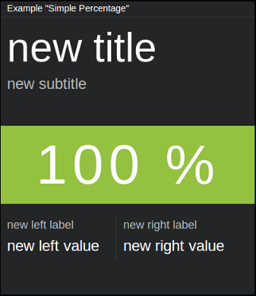

=====================
``simple_percentage``
=====================

**Description**

Tile displaying three arbitrary values (with labels) - one bigger ("main"
value) and two smaller (at the bottom-left and bottom-right of the tile). It is
possible to change background color for the main value.

**Content**

::

  data = {
      "title":       "<title>",
      "subtitle":    "<subtitle>",
      "big_value":   "<value1>",
      "left_value":  "<value2>",
      "right_value": "<value3>"
      "left_label":  "<label1>",
      "right_label": "<label2>"
  }

where:

.. describe:: title, subtitle

   They serve as a label for the ``big_value`` ("main" value).

.. describe:: big_value

   Main value, which treated as a string, so it can contain symbols like ``%`` etc.

.. describe:: left_value, right_value

   Smaller, bottom-left and bottom-right values.

.. describe:: left_label, right_label

   Labels for above values.

Example::

  curl http://localhost:7272/api/v0.1/<api_key>/push
       -X POST
       -d "tile=simple_percentage"
       -d "key=<tile_id>"
       -d 'data={"title": "My title", "subtitle": "My subtitle", "big_value": "100%",
                 "left_value": "50%", "left_label": "smaller label 1",
                 "right_value": "25%", "right_label": "smaller label 2"}'

**Configuration**

::

  value = {
      "big_value_color": "<color>",
      "fading_background": <BOOLEAN>
  }

where:

.. describe:: big_value_color

   Background color for ``big_value`` in a hexadecimal form or color name (e.g.
   ``#94C140`` or ``green``).

.. describe:: fading_background

   Turns on/off background pulsation for ``big_value`` (may be useful for alerts etc.).

   .. versionadded:: 1.3.0

Example::

  curl http://localhost:7272/api/v0.1/<api_key>/tileconfig/<tile_id>
       -X POST
       -d 'value={"big_value_color": "green", "fading_background": true}'
