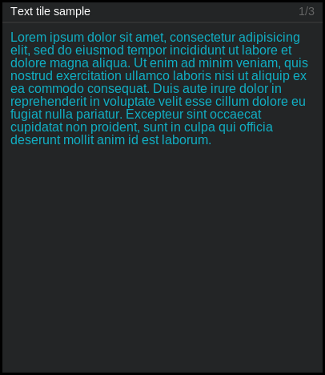

========
``text``
========

**Description**

Simple text-tile designated to display... (surprise!) text.

**Content**

::

  data = {"text": "<text_content>"}

where:

.. describe:: text_content

   A textual content to be displayed.

Example::

  curl http://localhot:7272/api/v0.1/<api_key>/push
       -X POST
       -d "tile=text"
       -d "key=mytext"
       -d 'data={"text": "Hello world!"}'

**Configuration**

::

  value = {"<config_element>": "<config_value>"}

where:

.. describe:: config_element

   One of three attributes of displayed text (i.e. ``font_size``, ``color`` and
   ``font_weight``).

.. describe:: config_value

   Value matching above.

Example::

    curl http://localhost:7272/api/v0.1/<api_key>/tileconfig/mytext
         -X POST
         -d 'value={"font_color": "#00FF00"}'

.. note::

   Parameter ``font_size`` can be specified in two ways - as a number (e.g.
   ``"font_size": 10``) or as a string (e.g. ``"font_size": "10px"``) - both of
   them have the same effect.

   Keys ``font_size``, ``color``, ``font_weight`` with empty ``config_value``
   are ignored (in such case, they will inherit those values from parent CSS).
